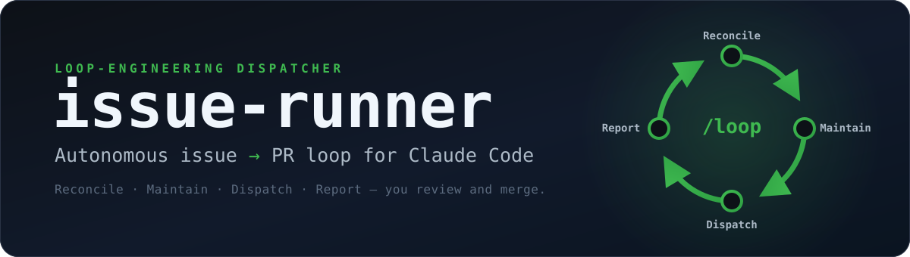
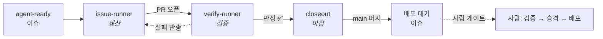
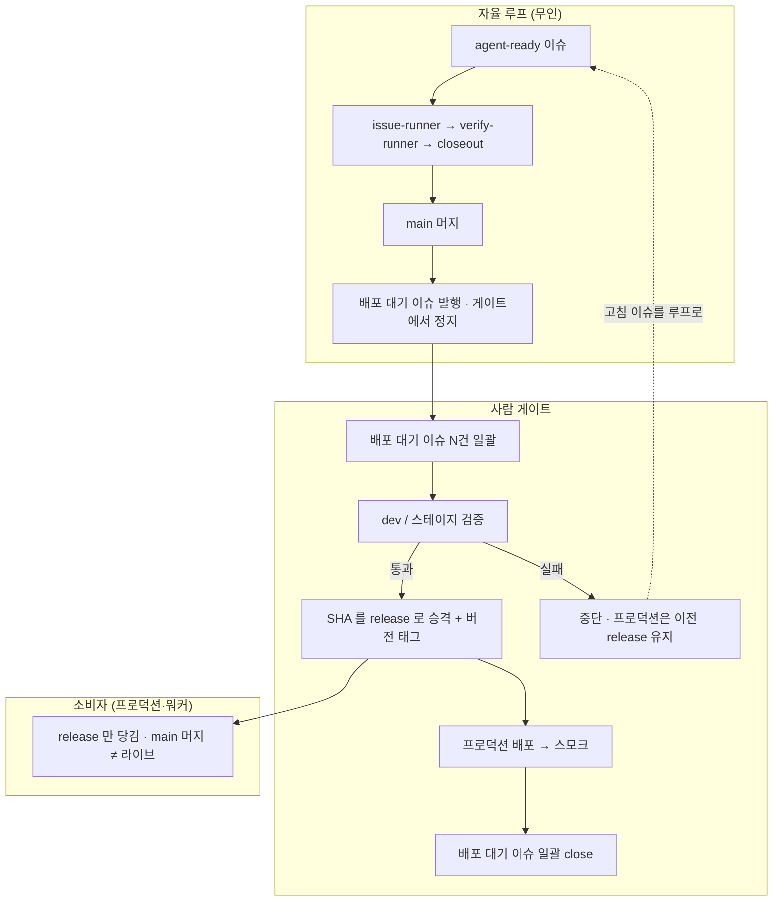

<div align="center">



<p>
  <a href="README.md">English</a> &nbsp;·&nbsp; <strong>한국어</strong>
</p>

<p>
  <a href="LICENSE"></a>
  
  
  
  
</p>

<p><strong>절대 머지하지 않는 이슈&nbsp;→&nbsp;PR 공장.</strong><br>
검증·배포까지 잇는 도크 <code>/closeout</code> 과 짝을 이룬다.<br>
두 루프, 한 레포, 사람 게이트는 중요한 곳에만.</p>

</div>

---

issue-runner 는 [Claude Code](https://claude.com/claude-code) 를 위한 **루프 엔지니어링 디스패처**다. `/loop` 로 돌리면 매 틱마다 GitHub 계정 전체에서 `agent-ready` 라벨이 붙은 이슈를 훑어, 하나를 집어 격리된 git worktree 에서 구현하고 PR 을 연다 — 그리고 다음으로 넘어간다. 사람은 이슈 큐를 큐레이션하고 PR 을 리뷰한다. 그 사이의 모든 일을 루프가 한다.

## 목차

- [왜 issue-runner 인가](#왜-issue-runner-인가)
- [동작 원리](#동작-원리)
- [빠른 시작](#빠른-시작)
- [루프에 태울 이슈 쓰기](#루프에-태울-이슈-쓰기)
- [루프 삼형제 — 공장·레인·도크](#루프-삼형제--공장레인도크)
- [배포 — main·release 와 배포 게이트](#배포--mainrelease-와-배포-게이트)
- [가드레일](#가드레일)
- [설치](#설치) · [운영](#운영) · [전제 조건](#전제-조건)
- [참고 자료](#참고-자료) · [라이선스](#라이선스)

## 왜 issue-runner 인가

코딩 에이전트는 코드를 짤 수 있다. 병목은 그 *주변* 전부다 — 다음 준비된 이슈를 고르고, 깨끗한 작업공간을 띄우고, PR 을 초록불로 유지하고, 머지 뒤를 정리하고, 폭주한 에이전트가 오후를 통째로 태우지 않게 막는 일.

**issue-runner 는 그 "주변" 을 도는 루프다.** 사람은 두 가지만 한다 — 이슈 큐를 큐레이션하고, PR 을 리뷰·머지한다. 그 사이 디스패처가 무인으로 돈다: claim → 격리 worktree 에서 구현 → PR → 반복.

켜두고 자리를 비워도 되는 두 가지 속성:

- **절대 머지하지 않는다.** 설정이 아니라 하드 불변이다. 머지는 사람 몫으로 남는다 — 옵트인하면 *별도* 루프([`/closeout`](#루프-삼형제--공장레인도크))가 맡는다. "issue-runner 는 머지 안 함" 과 "머지가 자동화될 수 있음" 은 주체가 다르므로 모순이 아니다.
- **모든 가드레일이 최악의 경우를 상한으로 묶는다.** 동시성 제한, PR 당 보수 서킷 브레이커, 이슈당 타임박스, 열린 PR 배압. 자리를 비운 대가는 유한하며, 레포 전체가 아니다. [가드레일](#가드레일) 참조.

상태의 단일 진실 원천은 **GitHub 자체** — 라벨·assignee·PR 상태다. 손상되거나 어긋날 로컬 상태 파일이 없고, 매 틱 현실과 대조하므로 루프를 언제 멈췄다 재개해도 된다.

### 하네스가 아니라 오케스트레이션 레이어

오해 없이 말하면 — issue-runner 는 분명 에이전트를 *오케스트레이션*한다: 워커를 스폰하고 생애주기를 관리하고 가드레일을 쥔다. 그 점에선 하네스적이다. 다만 *일부러* **자체 런타임이 아니다** — 바이너리·데몬·에이전트 엔진을 스스로 들고 있지 않다. Claude Code 의 하네스를 **타는** 얇은 **스킬**(+결정론 bash)이고, 그걸 내 이슈 백로그로 향하게 한다 — 이미 쓰는 에이전트를 교체가 아니라 **조합**한다. 그 선택이 성격 전부를 규정한다:

- **설치하거나 띄울 게 없다.** bash 스크립트 ~15개와 마크다운을 `~/.claude/skills` 에 심링크할 뿐. 런타임도, 컴파일도, 백그라운드 서비스도 없다 — 반나절이면 전체를 읽고 레포에 무슨 짓을 하는지 정확히 감사할 수 있다.
- **상태의 유일 원천은 GitHub.** 백업·손상·동기화할 독자 세션 파일이 없다(작은 `.loop/lessons.md` 캐시 예외). 진실이 라벨·PR 에 있으므로 어떤 중단 뒤에도 깨끗이 재개하고, 순수 `gh` 로 전부 조회되며, 서로 네트워크로 안 닿는 두 머신이 레포 하나만으로 협업한다.
- **작업이 아니라 백로그를 비운다.** 다음 준비된 이슈를 스스로 골라, 옵트인한 모든 레포에 걸쳐 무인으로 워커 함대를 굴린다. 목표는 네가 운전하는 한 문제의 깊이가 아니라, 네가 큐레이션하는 큐의 처리량이다.

자체 런타임으로 한 작업을 깊게 모는 독립 러너가 필요하면 그런 걸 써라. 자리를 비운 사이 `agent-ready` 백로그가 Claude Code 위에서 조용히 리뷰 가능한 PR 로 바뀌길 원하면, 그게 이것이다.

## 동작 원리

단일 디스패처 스킬(`/issue-runner`)을 `/loop` 로 주기 실행한다. 매 **틱**은 네 단계를 순서대로 수행한다:

| 단계 | 하는 일 |
|---|---|
| ① **Reconcile** | claim 된 이슈 전수 점검 — 머지/거부된 PR 정리, 죽은 claim 해제, 교훈(lessons) 기록 |
| ② **Maintain** | 열린 PR 보수 — CI 실패 수리, 리뷰 코멘트 해결, base conflict rebase |
| ③ **Dispatch** | 남는 슬롯만큼 신규 이슈 claim → worktree 생성 → 백그라운드 워커 투입 |
| ④ **Report** | 한 줄 요약 — `정리 N · 보수 N · 신규 N · 대기 N · warn N` |

워커는 매 커밋마다 push 하므로 worktree 는 언제 버려져도 되는 상태다. 루프가 버리지 않는 유일한 예외는 dirty/미push worktree — 안전하게 **보존하고 warn** 한다. 그때만 사람이 확인한다.

## 빠른 시작

```bash
# 1. clone 후 Claude Code 스킬 디렉토리에 symlink (위치는 자유)
git clone https://github.com/ggqgga/issue-runner ~/Projects/refs/issue-runner
mkdir -p ~/.claude/skills
ln -s ~/Projects/refs/issue-runner ~/.claude/skills/issue-runner

# 2. 레포를 루프에 옵트인 (라벨 세트 생성 + 머지 브랜치 자동삭제 설정)
~/.claude/skills/issue-runner/scripts/setup-labels.sh <owner/repo>
```

3. **이슈 작성.** 워커는 기획 맥락을 전혀 공유하지 않는다 — **이슈 본문이 유일한 스펙**이다. 구체적·검증가능한 수용 기준(`- [ ]`)과 실행할 검증 명령을 담은 `## Test plan` 을 적는다.

4. **라벨 부착 후 루프 실행.** Claude Code 에서:

   ```bash
   gh issue edit <N> --repo <owner/repo> --add-label agent-ready --add-label P2
   ```
   ```
   /loop 15m /issue-runner
   ```

15분마다 틱이 돈다: 디스패처가 이슈를 claim 하고, 백그라운드 워커가 구현해 PR 을 연다. 사람이 리뷰·머지하면 다음 틱의 Reconcile 이 worktree 를 정리하고 넘어간다.

> **자연어로도 된다.** Claude Code 는 스킬 설명으로 라우팅하므로 "이슈 루프 돌려줘", "이 이슈 루프에 넘겨줘" 같은 말도 같은 곳에 닿는다. 전체 절차는 [설치](#설치)·[운영](#운영) 참조.

## 루프에 태울 이슈 쓰기

전체가 제대로 돌지 마는지를 가르는 급소다. 워커는 네 기획 맥락을 **하나도** 공유하지 않는다 — **이슈 본문이 곧 스펙 전부**다. 모호한 이슈는 모호한 PR 을 만드는 게 아니라, **엉뚱한 문제를 자신 있게 푼** PR 을 만든다. 이 앞문만 제대로 잡으면 이후는 쉽다.

그래서 레포는 그 앞문으로 두 번째 스킬 **[`/loop-issues`](skills/loop-issues/SKILL.md)** 를 함께 담는다 — 무인으로 구현 가능한 이슈만 `agent-ready` 로 통과시키는 게이트다. **세 모드**가 있고, 전부 자연어로 닿는다:

- **이슈 하나 마감** ("이거 루프에 태워줘") — 지금 보는 이슈를 체크리스트에 통과시키고, **통과할 때만** `agent-ready` + 우선순위를 붙인다. 미달이면 잘못된 디스패치 대신 **뭐가 빠졌는지 목록**을 돌려준다.
- **계획에서 생성** ("루프 이슈로 만들어줘" / "이거 루프로 태울 예정이야") — 아직 이슈가 아닌 일이면, 스펙을 **새 이슈**로 써 넣고 — *high* 난이도는 `Blocked by #N` 로 직렬화한 sub-issue 로 분해하거나 **`## Plan`**(번호 task + 각 task가 건드리는 파일 + task별 검증 명령)을 첨부해 — 이어서 마감한다. 이 **계획→이슈** 단계가, 큰 아이디어를 하나의 거대·모호한 티켓이 아니라 루프에 태울 수 있는 일로 바꾸는 지점이다.
- **백로그 트리아지** ("루프로 진행할 수 있는 이슈 분석해줘") — **옵트인된** 레포(라벨 세트가 있는)를 훑어, 이미 `agent-ready`/`agent:claimed`/`needs-human` 붙은 이슈는 건너뛰고, 나머지를 **READY / FIXABLE / UNFIT** 로 분류하며 고칠 수 있는 건 보완안을 제안한다. 승인 전에는 아무것도 재라벨하지 않는다.

세 모드가 공통으로 강제하는 체크리스트, 요약하면: **자기완결 스펙** · **체크박스 수용 기준**("잘 동작" 금지) · 실제 명령이 든 **`## Test plan`** · `Blocked by #N` 라인의 **의존성** · **우선순위** 라벨 · **epic → 분해, leaf 에만 라벨** · **레포 준비**(라벨 세트 + 레포 `CLAUDE.md` 의 빌드/테스트 명령) · 같은 모듈을 건드리는 다른 in-flight 이슈와 **충돌 없음** · 그리고 **난이도** 판단(high 는 분해 또는 `## Plan` 먼저). `agent-ready` 는 이 모든 걸 마친 뒤 **맨 마지막**에 붙인다 — 디스패처는 임의로 붙이지 않는다.

## 루프 삼형제 — 공장·레인·도크

issue-runner 는 **공장**이다 — PR 을 생산하고 절대 머지하지 않는다. 두 *옵트인* 루프가 마감을 잇고, 각각 자기 `/loop` 세션에서 돈다:

| 루프 | 역할 | 머지? |
|---|---|---|
| [`/issue-runner`](SKILL.md) | 이슈 → 구현 → **PR** (생산) | **안 함** (불변) |
| [`/verify-runner`](skills/verify-runner/SKILL.md) | 느린 외부툴 검증 — E2E `test:system` + codex 리뷰, 한 번에 PR 하나 (검증) | 안 함 |
| [`/closeout`](skills/closeout/SKILL.md) | 초록불 PR → 머지 · 문서 reconcile · 배포준비 · 파생발행 (마감) | **독점** |



세 루프가 충돌하지 않는 이유는 소유권이 **라벨 경계**이기 때문이다: closeout 이 PR 을 집으면 `harvesting` 라벨을 달고, issue-runner 는 `harvesting` PR 을 건드리지 않는다. verify-runner 도 `flow:verify` PR 을 같은 방식으로 점유한다. closeout 은 한 틱에 PR 하나를 끝까지 마감하며(`MAX_CLOSEOUT = 1`), 페이스는 `/loop` 주기로 조절한다. 그리고 자율에는 천장이 있다 — 루프는 `main` 머지·계획문서 reconcile·후속 이슈 발행까지 무인으로 하지만, **프로덕션 배포는 사람 게이트**다: closeout 이 "배포 대기" 이슈를 발행하고 거기서 멈춘다. 여기서 머지는 항상 사람이 한다는 issue-runner 불변은 그대로다. 상세는 [`skills/closeout/SKILL.md`](skills/closeout/SKILL.md).

<details>
<summary><b>왜 검증 레인을 따로 두나?</b></summary>

<br>

검증(헤드리스 크롬 E2E + 외부 codex CLI)은 *느리다.* 예전엔 issue-runner 가 디스패치한 타임박스 워커 안에서 인라인으로 돌렸다 — 워커가 그 느린 일을 끝내기 전 죽거나 시간초과되면 PR 이 드롭됐고, 여러 워커가 동시에 뜨면 그만큼 배로 샜다. 검증을 **버리지 않고 매 틱 재집는 전용 루프**가 소유하면 드롭이 원천 불가하고, 엄격 직렬(`MAX_VERIFY = 1`)이라 크롬 부하가 한 세트로 고정돼 박스가 안 터진다. 이것이 생산 → 검증 → 마감 3루프 분리다.

</details>

## 배포 — main·release 와 배포 게이트

루프는 `main` 까지 자율이고 **거기서 멈춘다.** `main` 머지는 배포가 *아니다.* 프로덕션은 별도 포인터 브랜치(관례상 `release`)를 추적하며, 그 브랜치는 사람만 전진시킨다 — 그래서 `main` 이 나아가도 "라이브" 를 뜻하지 않는다.

핸드오프는 이슈다. closeout 이 초록불 PR 을 `main` 에 머지하면 배포하지 않고 **배포 대기 이슈**를 발행하고 멈춘다. 그 이슈가 루프 → 사람 경계다. 거기서부터 사람이 게이트를 돈다:

1. **일괄(Batch)** — 배포 대기 이슈가 `main` 위에 쌓인다. 하나하나가 머지됐지만 아직 배포 안 된 변경이다.
2. **dev/스테이지 검증** — 사람이 배포 대기 이슈 묶음을 dev 서버/스테이지에서 확인한다. 루프가 스스로 완전히 증명하지 못한 동작을 실제로 돌려본다.
3. **승격(Promote)** — 통과한 SHA 를 `release` 로 승격하고 버전 태그를 찍는다. 실패하면 승격을 중단하고 프로덕션은 이전 `release` 를 유지한다.
4. **배포(Ship)** — 프로덕션(또는 워커)이 `release` 를 당겨 배포하고 스모크한다.
5. **마감(Close)** — 배포된 배포 대기 이슈를 일괄 종료한다. 사람이 깨졌다고 판단한 것은 고침 이슈가 되어 루프 맨 앞으로 다시 들어간다.



즉 `main` 은 루프가 소유하는 통합 브랜치, `release` 는 사람만 전진시키는 프로덕션 포인터, 버전 태그가 매 승격을 표시한다. 이 레포 자체의 스킬 변경도 같은 게이트를 지난다 — 머지된 PR 이 "배포 대기" 이슈를 발행하고, 사람이 심링크된 체크아웃을 동기화(`git pull`)·검증한 뒤에야 라이브가 된다.

## 가드레일

루프는 폭주를 안전하게 하도록 설계됐다 — 각 상한이 "사람이 잃을 수 있는 최악" 을 묶는다. 상수는 [`SKILL.md`](SKILL.md) 상단에 있다.

| 상수 | 기본값 | 동작 |
|---|---|---|
| `MAX_AGENTS` | `3` | 동시 in-flight 이슈. in-flight = 작업 중 + 보수 중 + 빨간 PR. 사람 리뷰만 기다리는 초록불 PR 은 슬롯을 점유하지 않는다 |
| `MAX_OPEN_PRS` | `10` | 열린 PR 배압. 도달 시 신규 디스패치만 멈추고(보수는 계속) Report 에 적체 warn |
| `MAX_REPAIRS_PER_PR` | `3` | PR 당 보수 상한. 초과하면 멈추고 이슈에 `needs-human` 라벨 (서킷 브레이커) |
| `ISSUE_TIMEBOX_HOURS` | `1` | PR 없이 이만큼 지난 워커는 중단·worktree 폐기. push 된 커밋은 재디스패치용으로 보존 |
| `SOFT_TOKEN_BUDGET_PER_ISSUE` | `300k` | 관측치 전용 — 중단하지 않고 Report 에 승격 권고만 표시 |

그리고 숫자가 아닌 불변: **issue-runner 는 절대 머지하지 않는다.** `needs-human` 이슈는 루프가 손을 뗀 상태 — 사람이 원인을 보고 라벨을 제거해야 다시 흐른다.

---

<details>
<summary><h3>설치</h3></summary>

<br>

issue-runner 는 프로젝트가 아니라 **사용자 레벨**(`~/.claude/skills`)에 설치한다 — 특정 레포가 아니라 *계정 전체*를 대상으로 하는 디스패처이기 때문이다: 루프 세션은 어느 디렉토리에서든 뜰 수 있고, 매 틱 옵트인한 레포들로 워커를 보낸다. 레포별 제어는 설치가 아니라 **옵트인 신호** — `setup-labels.sh` 가 만드는 라벨 세트다.

```bash
# 1. clone (위치는 자유)
git clone https://github.com/ggqgga/issue-runner ~/Projects/refs/issue-runner

# 2. Claude Code 가 인식할 스킬 symlink
mkdir -p ~/.claude/skills
ln -s ~/Projects/refs/issue-runner                     ~/.claude/skills/issue-runner
ln -s ~/Projects/refs/issue-runner/skills/loop-issues  ~/.claude/skills/loop-issues
ln -s ~/Projects/refs/issue-runner/skills/verify-runner ~/.claude/skills/verify-runner  # 검증 레인 (옵트인)
ln -s ~/Projects/refs/issue-runner/skills/closeout     ~/.claude/skills/closeout         # 마감 도크 (옵트인)

# 3. 각 레포를 루프에 옵트인 (= 옵트인 신호)
~/.claude/skills/issue-runner/scripts/setup-labels.sh <owner/repo>
```

`setup-labels.sh` 는 `gh repo edit --delete-branch-on-merge` 도 설정해 머지된 head 브랜치를 GitHub 가 자동 삭제하게 한다.

**라벨 규약:**

| 라벨 | 의미 |
|---|---|
| `agent-ready` | 집어가도 되는 이슈. 스펙 완결 후 **마지막에** 사람이(또는 `/loop-issues` 로) 부착. 디스패처는 임의로 붙이지 않는다 |
| `agent:claimed` | 디스패처가 점유 중. **수동 부착/제거 금지** — 루프가 라이프사이클을 관리 |
| `P0` / `P1` / `P2` | 우선순위 (최우선 → 낮음). 없으면 최하순위 |
| `blocked-by:<N>` / `Blocked by #N` | 의존성. 라벨 또는 전용 본문 라인 중 하나. OPEN 인 블로커가 하나라도 있으면 디스패치 제외. `<N>` 은 **이슈** 번호이며, 블로커가 닫히면 게이트가 자동 해제 |

자격 조건: `open + agent-ready + ¬agent:claimed + 모든 블로커 CLOSED`. 정렬: `P0 > P1 > P2 > 없음`, 동순위는 오래된 순.

**(선택) 워크플로우 hook.** GitHub Actions 를 쓰지 않는다 — 대신 레포가 루프 위생을 강제하는 Claude Code hook 세트([`hooks/`](hooks/))를 동봉한다: 로컬 CI 캐시 + 머지 게이트, 모든 PR 에 자동 codex 리뷰, 그리고 작업을 토픽 브랜치·이슈 추적 가능 상태로 묶는 가드 2개. 각각 옵트인 — 심링크 후 `~/.claude/settings.json` 에 등록한다.

| hook | 발동 | 하는 일 |
|---|---|---|
| `local-ci.sh` | PostToolUse · `git push` | `bin/ci` 를 백그라운드 실행, 결과 캐시, commit status 게시 |
| `ci-gate-before-pr-merge.sh` | PreToolUse · `gh pr merge` | 해당 HEAD 의 캐시된 CI 가 통과가 아니면 머지 차단 (fail-closed) |
| `codex-review-on-pr-create.sh` | PostToolUse · `gh pr create` | Claude 에게 독립 `codex:codex-rescue` diff 리뷰를 백그라운드 스폰하도록 지시 |
| `warn-on-main-branch.sh` | PreToolUse · `Write`/`Edit` | `main`/`master` 에서 편집 시 비차단 경고 — 먼저 브랜치 |
| `require-issue-in-pr.sh` | PreToolUse · `gh pr create` | 본문에 전용 `Closes/Refs #N` 라인 없는 PR 차단 (`(no-issue)` 로 우회) |

```bash
mkdir -p ~/.claude/hooks
for h in local-ci ci-gate-before-pr-merge codex-review-on-pr-create warn-on-main-branch require-issue-in-pr; do
  ln -s ~/Projects/refs/issue-runner/hooks/$h.sh ~/.claude/hooks/
done
```

```json
{
  "hooks": {
    "PreToolUse": [
      { "matcher": "Write|Edit", "hooks": [
        { "type": "command", "command": "~/.claude/hooks/warn-on-main-branch.sh" }
      ]},
      { "matcher": "Bash", "hooks": [
        { "type": "command", "command": "~/.claude/hooks/ci-gate-before-pr-merge.sh",
          "if": "Bash(gh pr merge*)", "timeout": 30 },
        { "type": "command", "command": "~/.claude/hooks/require-issue-in-pr.sh",
          "if": "Bash(gh pr create*)" }
      ]}
    ],
    "PostToolUse": [
      { "matcher": "Bash", "hooks": [
        { "type": "command", "command": "~/.claude/hooks/local-ci.sh",
          "if": "Bash(git push*)", "timeout": 20 },
        { "type": "command", "command": "~/.claude/hooks/codex-review-on-pr-create.sh",
          "if": "Bash(gh pr create*)", "timeout": 30 }
      ]}
    ]
  }
}
```

hook 은 Claude Code 하네스가 실행하므로 **세션 안에서의** 해당 동작에만 발동한다. PR-create hook 2개와 codex 리뷰는 `codex` 플러그인/실제 PR 이 없으면 no-op 이라 전부 켜도 안전하다.

**`repos.conf` — 경로 매핑 (필요할 때만).** 스크립트는 레포 체크아웃을 `$HOME/Projects/<레포명>` 에서 찾고(`ISSUE_RUNNER_PROJECTS_ROOT` 로 변경) 없으면 그리로 clone 한다. 다른 곳에 이미 있다면 이 레포 루트의 `repos.conf` 로 매핑한다(gitignore — 머신별 설정):

```
# <owner/repo> <절대경로>   — 한 줄에 하나
acme/webapp ~/Work/clients/acme-webapp
```

</details>

<details>
<summary><h3>운영</h3></summary>

<br>

**별도 세션에서 돌린다.** 기획(이슈 작성)과 루프를 다른 터미널로 분리한다 — 기획 세션은 이슈만 만들고, 루프 세션이 소비한다.

```
/loop 15m /issue-runner
```

**특정 레포로 스코프 좁히기.** 기본은 계정 전체다. 프로젝트별 루프를 한 세션이 다른 세션의 이슈를 집어가지 않게 돌리려면 세션의 작업 디렉토리에 `.loop/repos` 허용목록(줄당 `owner/repo` 하나)을 둔다. 파일이 없으면 계정 전체.

**Report 한 줄 읽는 법** — `정리 1 · 보수 0 · 신규 2 · 대기 3 · warn 0`:

| 항목 | 의미 |
|---|---|
| 정리 | 머지/거부된 PR 뒷정리 (worktree 제거, claim 해제, lessons 기록) |
| 보수 | 열린 PR 에 보수 워커 투입 (CI 수리·리뷰 코멘트·rebase) |
| 신규 | 새로 claim 해 워커를 투입한 이슈 |
| 대기 | 자격은 되지만 슬롯이 없어 다음 틱으로 미룬 이슈 |
| warn | 사람 확인 필요 — 사유가 함께 출력된다 |

**돌아가는 중 개입:**

- **PR 에 할 말이 있으면** 리뷰 코멘트를 남긴다 — 다음 Maintain 이 보수 워커를 투입한다. 머지는 언제나 사람이.
- **거부하려면** PR 을 머지 없이 닫는다 — Reconcile 이 `agent-ready` 까지 제거해 같은 일을 다시 벌이지 않는다. 재시도는 스펙 보완 후 라벨 재부착.
- **`agent:claimed` 는 수동으로 만지지 않는다** — 루프가 라이프사이클을 소유한다.

**lessons — 루프의 자기 개선.** PR 이 머지/거부될 때 디스패처가 객관적 실패 사실만(codex 로) 대상 레포의 `.loop/lessons.md`(gitignore, 20줄 캡)에 기록하고 이후 워커에 주입한다 — 같은 실수를 반복하지 않게. lessons 를 CLAUDE.md 로 승격하는 판단은 사람만 한다.

**트러블슈팅:**

| 증상 | 확인 |
|---|---|
| 이슈가 안 집힌다 | `scripts/eligible-issues.sh` 실행 — `agent-ready` 부착·`agent:claimed` 잔존·블로커 전부 CLOSED 여부. GitHub 검색 인덱스는 몇 분 지연될 수 있다 |
| 워커가 죽고 PR 이 없다 | 다음 Reconcile 이 회수 — push 된 커밋이 있으면 보수로 이어받고, 없으면 claim 을 풀어 재디스패치 |
| worktree 가 안 지워진다 | dirty/미push 면 reconcile 이 **보존하고 warn**. 확인 후 직접 `git worktree remove` |
| 워커가 "과거 교훈: 없음" 만 받는다 | `scripts/repo-dir.sh <owner/repo>` 경로 밑 `.loop/lessons.md` 확인 — gitignore 로컬이라 머신 이관 시 복사 필요 |

</details>

## 전제 조건

**필수:** [`gh`](https://cli.github.com/) (인증 완료 — `gh auth status`) · [`jq`](https://jqlang.github.io/jq/) · bash 3.2+ (macOS 기본 bash 로 충분 — 스크립트는 3.2 호환) · `/loop` 과 백그라운드 서브에이전트를 지원하는 Claude Code.

**선택:** `codex` 플러그인 — `codex:codex-rescue` 서브에이전트가 verify-runner 의 correctness 리뷰·closeout 의 계획 부합 검증·디스패처의 lessons 추출을 맡는다. 없으면 `general-purpose` 리뷰어로 폴백하므로 루프는 그대로 돈다 · [codegraph](https://github.com/colbymchenry/codegraph) (사전 인덱싱 코드 그래프 — 워커가 grep 대신 조회, 없으면 grep/Read 폴백) · 동봉된 [local-ci hook 세트](#설치) · `shellcheck` (이 레포 자체 `bin/ci` 가 설치 시 실행).

## 참고 자료

프롬프트가 아니라 루프 — 이 설계가 자라난 담론:

- [Keep Claude working toward a goal](https://code.claude.com/docs/en/goal) — Claude Code 공식 `/loop` 패턴. Reconcile → Dispatch → Report 틱이 여기서 출발했다.
- Boris Cherny("write loops, not prompts")와 Peter Steinberger(메인테이너 패턴 — 사람은 큐 큐레이션과 머지 판단만): [Claude Code Creator: "Write Loops, Not Prompts" (YouTube)](https://www.youtube.com/watch?v=EH2MMQTaPEA) · [r/myclaw 논의](https://www.reddit.com/r/myclaw/comments/1u047p8/so_is_loop_engineering_the_next_ai_dev_buzzword/).
- [`bin/ci` 컨벤션](https://guides.rubyonrails.org/8_1_release_notes.html) — Rails 8.1 의 실행형 CI 를 언어 무관으로 일반화.

## 라이선스

[MIT](LICENSE)
