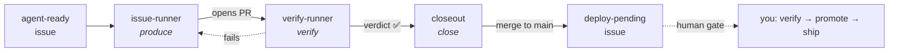
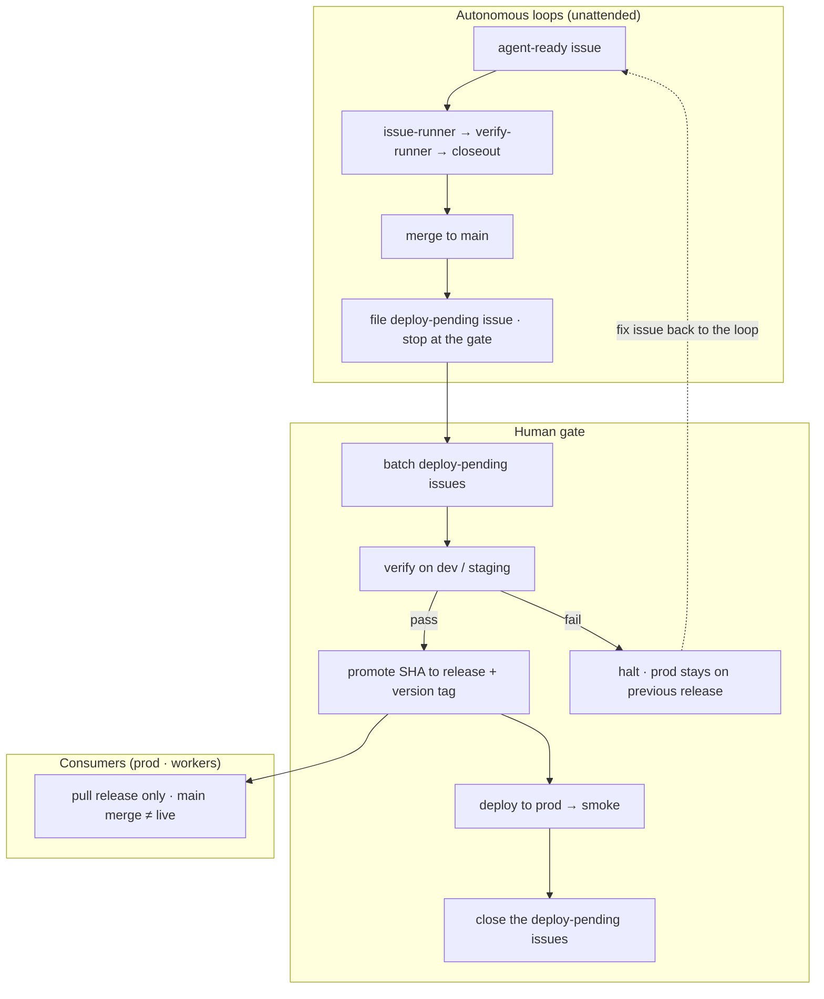

<div align="center">


<p>
  <strong>English</strong> &nbsp;·&nbsp; <a href="README.ko.md">한국어</a>
</p>

<p>
  <a href="LICENSE"></a>
  
  
  
  
</p>

<p><strong>An issue&nbsp;→&nbsp;PR factory that never merges.</strong><br>
Pair it with <code>/closeout</code> — the dock that verifies and ships.<br>
Two loops, one repo, human gates where they matter.</p>

<p>🇰🇷 <code>agent-ready</code> 이슈를 자동으로 집어 격리 worktree에서 구현하고 PR을 여는 자율 루프 — 머지는 사람 몫.<br>
<strong>전체 한글 문서 → <a href="README.ko.md">README.ko.md</a></strong></p>

</div>

---

issue-runner is a **loop-engineering dispatcher** for [Claude Code](https://claude.com/claude-code). Run it with `/loop`, and every tick it scans your GitHub account for issues you've labeled `agent-ready`, claims one, implements it in an isolated git worktree, and opens a PR — then moves to the next. You curate the issue queue and review the PRs. The loop does everything in between.

## Contents

- [Why issue-runner?](#why-issue-runner)
- [How it works](#how-it-works)
- [Quick start](#quick-start)
- [Writing loop-ready issues](#writing-loop-ready-issues)
- [The loop family — factory, lane, dock](#the-loop-family--factory-lane-dock)
- [Shipping — main, release & the deploy gate](#shipping--main-release--the-deploy-gate)
- [Guardrails](#guardrails)
- [Installation](#installation) · [Operating it](#operating-it) · [Requirements](#requirements)
- [Prior art](#prior-art) · [License](#license)

## Why issue-runner?

Coding agents can write the code. The bottleneck is everything *around* it — picking the next ready issue, spinning up a clean workspace, keeping the PR green, cleaning up after a merge, and not letting a runaway agent burn your afternoon.

**issue-runner is the loop that does the around-it part.** You do two things — curate the issue queue, and review & merge the PRs. Between those, the dispatcher runs unattended: claim → implement in an isolated worktree → open a PR → repeat.

Two properties make it safe to leave running:

- **It never merges.** That's a hard invariant, not a setting. Merging stays with you — or, if you opt in, with a *separate* loop ([`/closeout`](#the-loop-family--factory-lane-dock)). "issue-runner never merges" and "merges can be automated" are about different actors, so they don't conflict.
- **Every guardrail caps the worst case.** Concurrency limit, per-PR repair circuit breaker, per-issue timebox, open-PR backpressure. Walking away costs you a bounded amount, never your whole repo. See [Guardrails](#guardrails).

The single source of truth is **GitHub itself** — labels, assignees, PR state. There is no local state file to corrupt or sync; every tick reconciles against reality, so you can stop and resume the loop any time.

### An orchestration layer, not a runtime

Make no mistake — issue-runner *does* orchestrate agents: it dispatches workers, manages their lifecycle, and holds the guardrails. In that sense it's harness-like. What it deliberately **isn't** is a standalone runtime: it brings no binary, daemon, or agent engine of its own. It's a thin **skill** (plus deterministic bash) that rides Claude Code's harness and points it at your issue backlog — it composes with the agent you already run instead of replacing it. That choice is the whole personality:

- **Nothing to install or run.** ~15 bash scripts and some markdown, symlinked into `~/.claude/skills`. No runtime, no compile step, no background service — you can read the whole thing in an afternoon and audit exactly what it does to your repos.
- **GitHub is the only state.** No proprietary session files to back up, corrupt, or sync (a small `.loop/lessons.md` cache aside). Because the truth lives in labels and PRs, the loop resumes cleanly after any interruption, is fully inspectable with plain `gh`, and lets two machines that never touch each other collaborate through the repo alone.
- **It drains a backlog, not a task.** It picks the next ready issue itself and keeps a fleet moving across every opted-in repo, unattended. The goal isn't depth on one problem you're driving — it's throughput over a queue you curate.

If you want a standalone runner that drives one task deeply with its own runtime, reach for one of those. If you want your `agent-ready` backlog to quietly turn into reviewable PRs on top of Claude Code, that's this.

## How it works

A single dispatcher skill (`/issue-runner`) is run on an interval by `/loop`. Each **tick** runs four stages in order:

| Stage | What it does |
|---|---|
| ① **Reconcile** | Sweep every claimed issue — clean up merged/rejected PRs, release dead claims, record lessons |
| ② **Maintain** | Repair open PRs — fix failing CI, resolve review comments, rebase on base conflicts |
| ③ **Dispatch** | For each free slot, claim a new issue → create a worktree → launch a background worker |
| ④ **Report** | One-line summary — `cleaned N · repaired N · new N · waiting N · warn N` |

Workers push on every commit, so a worktree is always safe to discard. The only thing the loop won't throw away is a dirty or unpushed worktree — it **preserves and warns** instead, so that's the one case a human looks at.

## Quick start

```bash
# 1. Clone and symlink into Claude Code's skills directory (location is up to you)
git clone https://github.com/ggqgga/issue-runner ~/Projects/refs/issue-runner
mkdir -p ~/.claude/skills
ln -s ~/Projects/refs/issue-runner ~/.claude/skills/issue-runner

# 2. Opt a repo into the loop (creates the label set + enables branch auto-delete)
~/.claude/skills/issue-runner/scripts/setup-labels.sh <owner/repo>
```

3. **Write an issue.** The worker shares none of your planning context — **the issue body is the entire spec.** Give it concrete, checkable acceptance criteria and a `## Test plan` with the commands to run.

4. **Label it and run the loop.** In Claude Code:

   ```bash
   gh issue edit <N> --repo <owner/repo> --add-label agent-ready --add-label P2
   ```
   ```
   /loop 15m /issue-runner
   ```

Every 15 minutes a tick fires: the dispatcher claims the issue, a background worker implements it and opens a PR. You review and merge; the next tick's Reconcile cleans up the worktree and moves on.

> **Tip — natural language works too.** Claude Code routes on skill descriptions, so "run the issue loop" or "put this issue on the loop" reach the same place. Full walkthrough in [Installation](#installation) and [Operating it](#operating-it).

## Writing loop-ready issues

This is the part that decides whether the whole thing works. The worker shares **none** of your planning context — the **issue body is the entire spec**. A vague issue doesn't produce a vague PR; it produces a confident PR that solves the wrong problem. Get the front door right and everything downstream is easy.

So the repo ships a second skill, **[`/loop-issues`](skills/loop-issues/SKILL.md)**, as that front door — a gate that only lets an issue become `agent-ready` once it can actually be built unattended. It has **three modes**, all reachable by natural language:

- **Close out one issue** ("put this on the loop") — take the issue at hand, run it through the checklist, and attach `agent-ready` + a priority **only if it passes**. If it doesn't, you get a list of what's missing instead of a bad dispatch.
- **Create from a plan** ("make a loop issue for this" / "we'll put this on the loop") — when the work isn't an issue yet, it writes the spec into a **new** issue — decomposing *high*-difficulty work into sub-issues serialized with `Blocked by #N`, or attaching a **`## Plan`** (numbered tasks + the files each touches + a per-task verify command) — then closes it out. This plan-to-issue step is how a big idea becomes loop-ready work instead of one giant ambiguous ticket.
- **Triage a backlog** ("analyze which issues can go on the loop") — sweeps your **opted-in** repos (the ones with the label set), skips issues already labeled `agent-ready`/`agent:claimed`/`needs-human`, and classifies the rest as **READY / FIXABLE / UNFIT**, proposing fixes for the fixable ones. Nothing is relabeled until you approve.

The checklist every mode enforces, in short: a **self-contained spec** · **checkbox acceptance criteria** (no "works well") · a **`## Test plan`** with real commands · **dependencies** as `Blocked by #N` lines · a **priority** label · **epic → split, label only leaves** · **repo readiness** (label set present + build/test commands in the repo's `CLAUDE.md`) · **no collision** with another in-flight issue on the same module · and a **difficulty** judgment (high work gets decomposed or a `## Plan` first). Attach `agent-ready` **last**, after all of it — the dispatcher never adds it on its own.

## The loop family — factory, lane, dock

issue-runner is the **factory** — it produces PRs and never merges. Two *opt-in* loops finish the job, each run in its own `/loop` session:

| Loop | Role | Merges? |
|---|---|---|
| [`/issue-runner`](SKILL.md) | issue → implement → **PR** (produce) | **Never** (invariant) |
| [`/verify-runner`](skills/verify-runner/SKILL.md) | slow external checks — E2E `test:system` + codex review, one PR at a time (verify) | Never |
| [`/closeout`](skills/closeout/SKILL.md) | green PR → merge · docs reconcile · deploy-prep · spinoffs (close) | **Exclusively** |



They don't collide because ownership is a **label boundary**: when closeout claims a PR it labels it `harvesting`, and issue-runner won't touch a `harvesting` PR. verify-runner similarly owns `flow:verify` PRs. closeout finishes one PR to completion per tick (`MAX_CLOSEOUT = 1`), with pacing set by its `/loop` interval. And the autonomy has a ceiling — the loops merge to `main`, reconcile plan docs, and file follow-up issues on their own, but **production deploy is a human gate**: closeout files a "deploy-pending" issue and stops there. Details in [`skills/closeout/SKILL.md`](skills/closeout/SKILL.md).

<details>
<summary><b>Why a separate verification lane?</b></summary>

<br>

Verification (headless-Chrome E2E + an external codex CLI) is *slow*. It used to run inline inside the timeboxed worker that issue-runner dispatched — so if the worker died or timed out before finishing, the PR was dropped (and with several workers in flight, dropped several times over). A dedicated loop that **re-picks the work every tick instead of discarding it** makes drops impossible, and running strictly serial (`MAX_VERIFY = 1`) pins the Chrome load to one set at a time so the box doesn't fall over. That's the produce → verify → close split.

</details>

## Shipping — main, release & the deploy gate

The loops are autonomous up to `main`, and **stop there**. Merging to `main` is *not* shipping. Production tracks a separate pointer branch (conventionally `release`), and only a human advances it — so `main` moving forward never means "live."

The handoff is an issue. When closeout merges a green PR to `main`, it doesn't deploy — it files a **deploy-pending issue** and stops. That issue *is* the loop → human boundary. From there the human runs the gate:

1. **Batch** — deploy-pending issues accumulate on `main`, each one a merged-but-unshipped change.
2. **Verify on dev/staging** — you check the batch against a dev server, exercising the behavior the loops can't fully prove on their own.
3. **Promote** — passing SHAs are promoted to `release` and tagged with a version. A failure halts promotion; production stays on the previous `release`.
4. **Ship** — production (or a worker) pulls `release`, deploys, and smoke-tests.
5. **Close** — the shipped deploy-pending issues are closed in a batch. Anything you deem broken becomes a fix issue that re-enters the loop at the top.



So `main` is the integration branch the loops own, `release` is the production pointer only a human advances, and version tags mark each promotion. This repo's own skill changes ship through the same gate — a merged PR files a "deploy-pending" issue, and a human syncs (`git pull` the symlinked checkout) and verifies before it goes live.

## Guardrails

The loop is designed to run away safely — each limit bounds "the worst a human can lose." Constants live at the top of [`SKILL.md`](SKILL.md).

| Constant | Default | Behavior |
|---|---|---|
| `MAX_AGENTS` | `3` | Concurrent in-flight issues. In-flight = working + repairing + red PRs; a green PR waiting on human review does **not** hold a slot |
| `MAX_OPEN_PRS` | `10` | Open-PR backpressure. On reaching it, new dispatch pauses (repairs continue) and Report raises a backlog warn |
| `MAX_REPAIRS_PER_PR` | `3` | Repair cap per PR. Beyond it, the loop stops and labels the issue `needs-human` (circuit breaker) |
| `ISSUE_TIMEBOX_HOURS` | `1` | A worker with no PR after this long is stopped and its worktree discarded; pushed commits survive for re-dispatch |
| `SOFT_TOKEN_BUDGET_PER_ISSUE` | `300k` | Observation only — never interrupts, just flags a promotion recommendation in Report |

And the invariant that isn't a number: **issue-runner never merges.** A `needs-human` issue means the loop has let go — a human clears the cause and removes the label to let it flow again.

---

<details>
<summary><h3>Installation</h3></summary>

<br>

issue-runner installs at the **user level** (`~/.claude/skills`), not per-project — it's an *account-wide* dispatcher: a loop session can run from any directory and, each tick, sends workers into whichever repos have opted in. Per-repo control is not the install; it's the **opt-in signal** — the label set from `setup-labels.sh`.

```bash
# 1. Clone (location is free)
git clone https://github.com/ggqgga/issue-runner ~/Projects/refs/issue-runner

# 2. Symlink the skills Claude Code should see
mkdir -p ~/.claude/skills
ln -s ~/Projects/refs/issue-runner                     ~/.claude/skills/issue-runner
ln -s ~/Projects/refs/issue-runner/skills/loop-issues  ~/.claude/skills/loop-issues
ln -s ~/Projects/refs/issue-runner/skills/verify-runner ~/.claude/skills/verify-runner  # verification lane (opt-in)
ln -s ~/Projects/refs/issue-runner/skills/closeout     ~/.claude/skills/closeout         # dock / merge loop (opt-in)

# 3. Opt each repo into the loop (= the opt-in signal)
~/.claude/skills/issue-runner/scripts/setup-labels.sh <owner/repo>
```

`setup-labels.sh` also sets `gh repo edit --delete-branch-on-merge` so GitHub auto-removes merged head branches.

**Label convention:**

| Label | Meaning |
|---|---|
| `agent-ready` | The issue is safe to pick up. Attached **last**, after the spec is complete, by a human (or via `/loop-issues`). The dispatcher never adds it on its own |
| `agent:claimed` | The dispatcher owns it. **Do not add/remove by hand** — the loop manages the lifecycle |
| `P0` / `P1` / `P2` | Priority (highest → low). Missing = lowest |
| `blocked-by:<N>` / `Blocked by #N` | Dependency. Either the label or a dedicated body line; a blocker that is still OPEN keeps the issue out of dispatch. `<N>` is an **issue** number, and the gate auto-clears when the blocker closes |

Eligibility: `open + agent-ready + ¬agent:claimed + all blockers CLOSED`. Sort: `P0 > P1 > P2 > none`, ties oldest-first.

**Optional — workflow hooks.** GitHub Actions isn't used. Instead the repo ships a set of Claude Code hooks (in [`hooks/`](hooks/)) that enforce the loop's hygiene — a local CI cache + merge gate, an automatic codex review on every PR, and two guards that keep work on topic branches and traceable to issues. Each is opt-in: symlink it and register it in `~/.claude/settings.json`.

| Hook | Fires on | What it does |
|---|---|---|
| `local-ci.sh` | PostToolUse · `git push` | runs `bin/ci` in the background, caches the result, posts a commit status |
| `ci-gate-before-pr-merge.sh` | PreToolUse · `gh pr merge` | blocks the merge unless the cached CI for that HEAD passed (fail-closed) |
| `codex-review-on-pr-create.sh` | PostToolUse · `gh pr create` | tells Claude to spawn an independent `codex:codex-rescue` diff review in the background |
| `warn-on-main-branch.sh` | PreToolUse · `Write`/`Edit` | non-blocking warning when you edit on `main`/`master` — branch first |
| `require-issue-in-pr.sh` | PreToolUse · `gh pr create` | blocks a PR whose body has no dedicated `Closes/Refs #N` line (bypass with `(no-issue)`) |

```bash
mkdir -p ~/.claude/hooks
for h in local-ci ci-gate-before-pr-merge codex-review-on-pr-create warn-on-main-branch require-issue-in-pr; do
  ln -s ~/Projects/refs/issue-runner/hooks/$h.sh ~/.claude/hooks/
done
```

```json
{
  "hooks": {
    "PreToolUse": [
      { "matcher": "Write|Edit", "hooks": [
        { "type": "command", "command": "~/.claude/hooks/warn-on-main-branch.sh" }
      ]},
      { "matcher": "Bash", "hooks": [
        { "type": "command", "command": "~/.claude/hooks/ci-gate-before-pr-merge.sh",
          "if": "Bash(gh pr merge*)", "timeout": 30 },
        { "type": "command", "command": "~/.claude/hooks/require-issue-in-pr.sh",
          "if": "Bash(gh pr create*)" }
      ]}
    ],
    "PostToolUse": [
      { "matcher": "Bash", "hooks": [
        { "type": "command", "command": "~/.claude/hooks/local-ci.sh",
          "if": "Bash(git push*)", "timeout": 20 },
        { "type": "command", "command": "~/.claude/hooks/codex-review-on-pr-create.sh",
          "if": "Bash(gh pr create*)", "timeout": 30 }
      ]}
    ]
  }
}
```

The hooks are run by the Claude Code harness, so they fire only on the matching action **inside a session**. The two PR-create hooks and the codex review are no-ops without the `codex` plugin / a real PR, so it's safe to enable them all.

**`repos.conf` — path mapping (only if needed).** Scripts look for a repo's checkout at `$HOME/Projects/<repo-name>` (override with `ISSUE_RUNNER_PROJECTS_ROOT`), cloning there if absent. If a checkout already lives elsewhere, map it in `repos.conf` (in this repo's root; gitignored — it's machine-specific):

```
# <owner/repo> <absolute-path>   — one per line
acme/webapp ~/Work/clients/acme-webapp
```

</details>

<details>
<summary><h3>Operating it</h3></summary>

<br>

**Run it in its own session.** Keep planning (writing issues) and the loop in separate terminals — the planning session makes issues, the loop session consumes them.

```
/loop 15m /issue-runner
```

**Scoping to specific repos.** By default the loop targets your whole account. To run per-project loops without one session stealing another's issues, drop a `.loop/repos` allowlist in the session's working directory (one `owner/repo` per line). No file = whole account.

**Reading the Report line** — `cleaned 1 · repaired 0 · new 2 · waiting 3 · warn 0`:

| Field | Meaning |
|---|---|
| cleaned | merged/rejected PRs tidied up (worktree removed, claim released, lessons recorded) |
| repaired | repair workers dispatched to open PRs (CI fix, review comments, rebase) |
| new | freshly claimed issues that got a worker |
| waiting | eligible but no free slot — deferred to a later tick |
| warn | needs a human look — the reason is printed inline |

**Intervening while it runs:**

- **Something to say about a PR?** Leave a review comment — the next Maintain dispatches a repair worker. Merging is always yours.
- **Rejecting?** Close the PR unmerged — Reconcile strips `agent-ready` too, so the loop won't re-open the same work. To retry, improve the spec and re-add the label.
- **Never touch `agent:claimed` by hand** — the loop owns that lifecycle.

**lessons — the loop's self-improvement.** When a PR merges or is rejected, the dispatcher extracts the objective failure facts (via codex) into the target repo's `.loop/lessons.md` (gitignored, 20-line cap) and injects them into later workers, so the same mistake isn't repeated. Promoting a lesson into CLAUDE.md is a human call.

**Troubleshooting:**

| Symptom | Check |
|---|---|
| Issue not picked up | Run `scripts/eligible-issues.sh` — is `agent-ready` on, `agent:claimed` off, all blockers CLOSED? GitHub's search index can lag a few minutes |
| Worker died, no PR | Next Reconcile recovers it — pushed commits get picked up as a repair; none → claim released for re-dispatch |
| Worktree won't delete | Dirty or unpushed → reconcile **preserves and warns**. Inspect, then `git worktree remove` yourself |
| Worker only gets "no prior lessons" | Check `.loop/lessons.md` under `scripts/repo-dir.sh <owner/repo>` — it's gitignored/local, so a machine move needs it copied over |

</details>

## Requirements

**Required:** [`gh`](https://cli.github.com/) (authenticated — `gh auth status`) · [`jq`](https://jqlang.github.io/jq/) · bash 3.2+ (stock macOS bash is fine — scripts are 3.2-compatible) · Claude Code with `/loop` and background subagents.

**Optional:** the `codex` plugin — its `codex:codex-rescue` subagent powers verify-runner's correctness review, closeout's plan-conformance check, and the dispatcher's lessons extraction; without it they fall back to a `general-purpose` reviewer, so the loop still runs · [codegraph](https://github.com/colbymchenry/codegraph) (pre-indexed code graph — workers query it instead of grepping; falls back to grep/Read when absent) · the bundled [local-ci hook set](#installation) · `shellcheck` (this repo's own `bin/ci` runs it when installed).

## Prior art

Loops, not prompts — the discourse this design grew out of:

- [Keep Claude working toward a goal](https://code.claude.com/docs/en/goal) — Claude Code's official `/loop` pattern; the Reconcile → Dispatch → Report tick starts here.
- Boris Cherny ("write loops, not prompts") and Peter Steinberger (the maintainer pattern — humans curate the queue and judge merges): [Claude Code Creator: "Write Loops, Not Prompts" (YouTube)](https://www.youtube.com/watch?v=EH2MMQTaPEA) · [r/myclaw discussion](https://www.reddit.com/r/myclaw/comments/1u047p8/so_is_loop_engineering_the_next_ai_dev_buzzword/).
- [`bin/ci` convention](https://guides.rubyonrails.org/8_1_release_notes.html) — Rails 8.1's executable CI, generalized here to be language-agnostic.

## License

[MIT](LICENSE)
