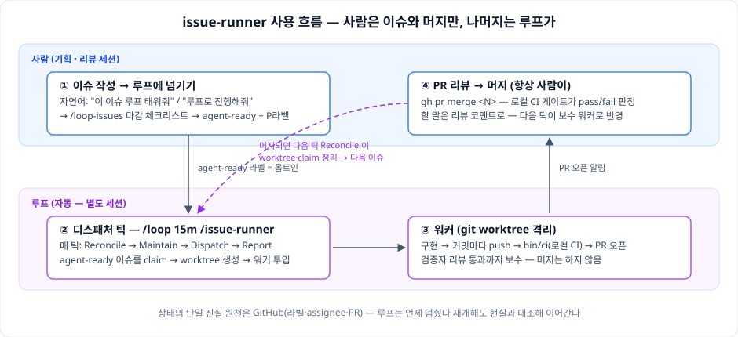
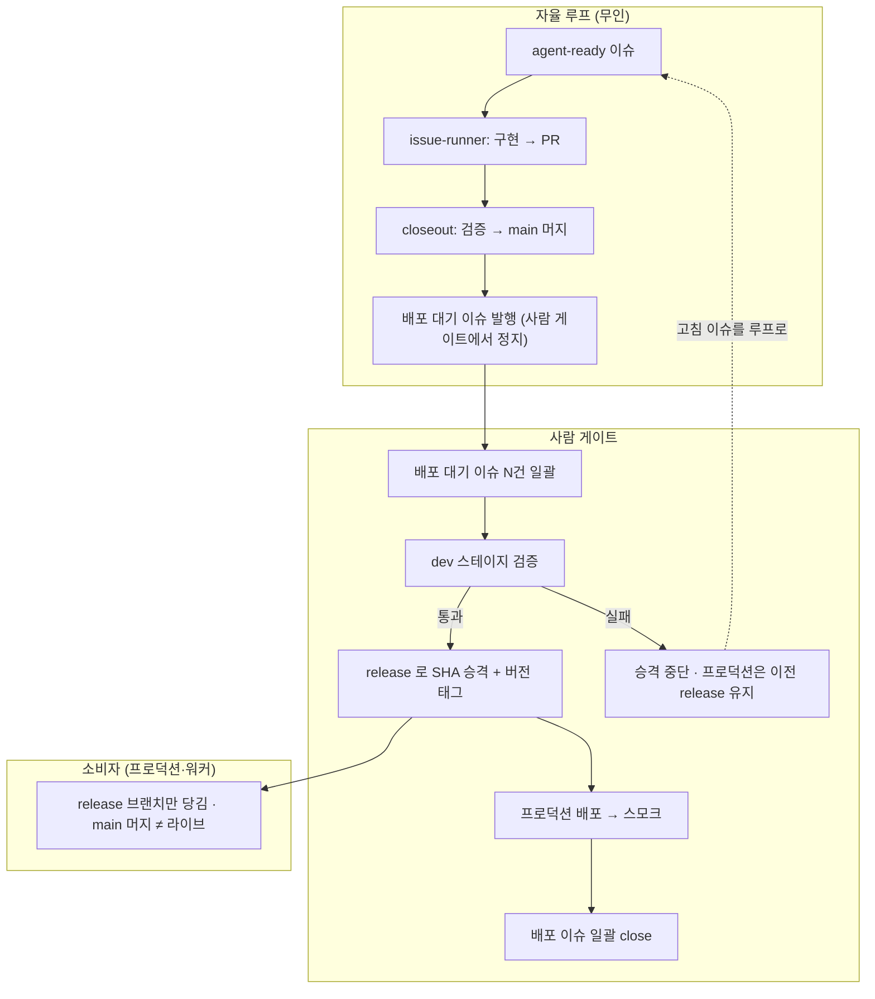

# issue-runner

루프 엔지니어링 디스패처 — GitHub 계정 전체에서 `agent-ready` 라벨이 붙은 이슈를
자동으로 집어, git worktree 격리 환경에서 구현하고 PR을 여는 자율 루프.
**머지는 항상 사람이 한다 — issue-runner 는 절대 머지하지 않는다.**[^merge]

[^merge]: 이 불변은 issue-runner **자체**에 대한 것이며 그대로다 — 디스패처는
    어떤 경우에도 머지하지 않는다. 머지 자동화가 필요하면 **별도의** 옵트인 루프
    [`/closeout`](#두-루프-분업--공장과-도크)이 초록불 PR 만 골라 수행한다. 즉
    "issue-runner 는 머지 안 함"과 "머지가 자동화될 수 있음"은 주체가 다르므로
    모순이 아니다 (전자=디스패처, 후자=별도 closeout 루프).

> English: skill docs are available in English — [SKILL.en.md](SKILL.en.md) · [skills/loop-issues/SKILL.en.md](skills/loop-issues/SKILL.en.md) (한국어판이 원본).

## 어떻게 쓰나 (한눈에)



설치([§설치](#설치)) 후의 일상 사용은 세 step 이 전부다:

| step | 하는 일 | 어떻게 |
|---|---|---|
| 1 | **이슈를 루프에 넘긴다** | 기획 세션에서 `/loop-issues` — 마감 체크리스트(스펙 완결성·의존성 등 9항목)를 통과한 이슈에 `agent-ready` + 우선순위 라벨이 붙는다 |
| 2 | **루프를 돌린다** | **별도 세션**에서 `/loop 15m /issue-runner` — 매 틱 디스패처가 이슈를 집어 worktree에서 구현하고 PR을 연다. 여러 프로젝트 루프를 병행하려면 [세션 레포 스코프](#상시-구동) 참조 |
| 3 | **PR 리뷰 → 머지** | **기본**: 사람이 직접 `gh pr merge <N>` (선택 전제인 local-ci hook을 설치한 `bin/ci` 옵트인 레포면 게이트가 판정 — 그 외에는 일반 merge). 고칠 게 있으면 리뷰 코멘트만 남기면 다음 틱이 보수 워커로 반영한다. **closeout 옵트인 시**: 머지·문서반영·배포준비까지 자동이고 사람은 배포(승격) 게이트만 잡는다 ([두 루프 분업](#두-루프-분업--공장과-도크)) |

머지되면 다음 틱의 Reconcile이 worktree·claim을 정리하고 다음 이슈로 넘어간다.
예외는 dirty/미push worktree — 안전하게 **보존하고 warn**으로 알리므로 그때만
사람이 확인한다 ([트러블슈팅](#트러블슈팅) 참조).

**왜 켜두고 자리를 비워도 되나 — 가드레일.** 루프는 폭주를 가정하고 설계됐고,
각 장치는 "최악의 경우 사람이 잃는 것"을 상한으로 묶는다: **issue-runner 는 머지를
절대 하지 않는다**(항상 사람 — 머지 자동화는 [별도 `/closeout` 루프](#두-루프-분업--공장과-도크)의 옵트인 영역)
· 동시 작업 5개 제한(`MAX_AGENTS`) · 같은 PR 보수 3회 초과 시
`needs-human`으로 손 떼기(서킷 브레이커) · PR 없이 1시간 끌면 워커 회수(타임박스) ·
열린 PR 10개 도달 시 신규 투입 중단(배압). 전체 표와 상수 조정은
[가드레일](#가드레일) 참조.

**자연어로 쓰기** — Claude Code가 스킬 설명으로 라우팅하므로 명령 대신 말로 해도 된다:

| 이렇게 말하면 | 일어나는 일 |
|---|---|
| "이 이슈 루프 태워줘" / "루프로 진행해줘" / "루프에 넘겨줘" | 해당 이슈를 마감 체크리스트로 검증 → `agent-ready` 부착 (step 1) |
| "이슈 마감해줘" / "agent-ready 붙여줘" | 〃 |
| "루프로 진행할 수 있는 이슈 분석해줘" / "이슈 분석하고 라벨 붙여줘" | **트리아지 모드** — 레포의 기존 open 이슈를 일괄 분석·분류 후 적합한 것만 마감 |
| "루프 시작해줘" | `/loop 15m /issue-runner` 상시 구동 (step 2) |
| "마감 루프 돌려줘" / "PR 마감해줘" | `/loop 20m /closeout` — 초록불 PR 을 검증·머지·문서반영·배포준비까지 자동 마감 ([두 루프 분업](#두-루프-분업--공장과-도크)) |

단계별 상세 절차는 [빠른 시작](#빠른-시작--첫-이슈-한-바퀴), 운영 규칙은 [사용법](#사용법) 참조.

## 두 루프 분업 — 공장과 도크

이 레포에는 `/loop`로 돌리는 자율 루프가 **둘** 있다. issue-runner 가 일을 벌리는
**공장**이라면, `/closeout`(에픽 #41)은 그 산출물을 끝까지 마감하는 **도크**다.
머지는 closeout 의 독점이다 — issue-runner 는 여전히 어떤 경우에도 머지하지 않는다.

| 루프 | 역할 | 머지 |
|---|---|---|
| `/issue-runner` | 이슈 → 구현 → PR (벌리는 공장) | **안 함** (불변) |
| `/closeout` | 초록불 PR → 검증·머지·문서반영·배포준비·후속발행 (마감 도크) | **독점 수행** |

두 루프가 같은 레포에서 동시에 돌아도 충돌하지 않는 이유와 자율 범위:

- **`harvesting` 라벨 = closeout 점유.** closeout 이 마감할 PR 을 집으면 그 PR 에
  `harvesting` 라벨을 단다. issue-runner ② Maintain 은 `harvesting` 이 붙은 PR 을
  건드리지 않는다 — 이 라벨이 두 루프의 작업 경계다.
- **자율 범위 = 머지·문서·파생은 자동, production 실 배포는 사람 게이트.**
  closeout 은 머지·계획문서 reconcile·후속 이슈 발행까지 무인으로 하지만,
  production 실 배포는 자동으로 하지 않는다 — 배포 단계는 사람이 게이트한다.
  - **승격(promotion) 모델 호환.** 소비 레포는 main(통합)/release(프로덕션 포인터)
    승격 모델을 쓸 수 있다 — 루프는 main 에만 머지하고, closeout 4단계의 배포 대기
    이슈가 사람 게이트(dev 검증 → release 승격 → 배포)의 입력이 된다. 이 경우에도 두
    루프의 계약은 무변경이며, 승격(release push)도 배포와 마찬가지로 루프가 하지
    않는다. Phase A 의 "배포 dry-run 까지"와 양립한다(승격·배포 모두 사람 게이트).
    (예: BoDAT — BodaT#870)
- **머지 직후 worktree 정리는 closeout 이 직접 한다.** 머지를 독점하는 closeout 이
  `gh pr merge` 성공 직후 공유 헬퍼 `cleanup-worktree.sh ... --merged` 로 그 PR 의
  worktree 를 스스로 거둔다 — issue-runner reconcile 이 멈춰 있어도(closeout-only
  세션) worktree 가 적체되지 않는다. issue-runner reconcile 도 같은 헬퍼를 쓰지만
  `--merged` 없이(미push 가드 유지) 호출한다.
- **`MAX_CLOSEOUT = 1`** — 한 틱에 1 PR 만 끝까지 마감하는 직렬화 스로틀이다.
  마감 페이스는 `/loop` 주기로 조절한다 (예: `/loop 20m /closeout`).
- **Phase A / B 범위.** 현재는 **Phase A** — 안전 코어(검증·머지·문서·파생)와
  배포 dry-run 까지만 한다. 실 자동 배포(**Phase B**)는 추후 별도로 연다.

승격 모델을 쓰는 레포에서의 전체 흐름 — 자율 루프(무인)·사람 게이트·소비자 세 줄기:



범용 어휘(소비 레포·dev 스테이지·release 포인터)로 그렸고 BoDAT 은 예시일 뿐이다.
GitHub 이 위 블록을 도식으로 렌더한다 (미지원 뷰어에서는 코드블록으로 보인다).

**쓰는 법** — issue-runner 와 **별도 세션**에서 `/loop 20m /closeout` 를 돌린다
(설치는 [§설치](#설치) — closeout 도 전용 심링크가 필요하다). issue-runner 세션이
PR 을 벌리는 동안 closeout 세션이 초록불이 된 PR 을 골라 마감한다.

## 개념

단일 디스패처(`/issue-runner` 스킬)를 `/loop`로 주기 실행한다. 매 틱(tick)마다
네 단계를 순서대로 수행한다:

| 단계 | 역할 |
|---|---|
| ① Reconcile | claim된 이슈 전수 점검 — 머지/거부된 PR 정리, 죽은 claim 해제, 교훈(lessons) 기록 |
| ② Maintain | 열린 PR 보수 — CI 실패 수리, 리뷰 코멘트 해결, base conflict rebase |
| ③ Dispatch | 남는 슬롯만큼 신규 이슈 claim → worktree 생성 → 백그라운드 워커 투입 |
| ④ Report | 한 줄 요약 (`정리 N · 보수 N · 신규 N · 대기 N · warn N`) |

**closeout 틱** (옵트인 시 별도 `/loop` 세션) — 매 틱 Reconcile → Pick(틱당 1 PR,
`harvesting` 라벨로 점유) → 파이프라인 6단계(① 계획 부합 검증 ② 머지 게이트 ③ 문서
reconcile ④ 배포 대기 이슈 발행=사람 게이트 ⑤ 배포 후 스모크 ⑥ 파생 이슈) → Report.
절차 SSOT 는 [`skills/closeout/SKILL.md`](skills/closeout/SKILL.md) — 여기 요약은
그 발췌다. 두 루프의 분업은 [두 루프 분업](#두-루프-분업--공장과-도크) 참조.

설계 원칙:

- **상태의 단일 진실 원천은 GitHub** (라벨·assignee·PR 상태). 로컬 상태 파일을
  두지 않고 매 틱 현실과 대조한다.
- **결정론적 판단은 bash 스크립트** (`scripts/` — 자격 필터·claim·정리),
  **재량 판단은 LLM** (`SKILL.md` — 충돌 회피·수리 방법).
- 워커는 매 커밋마다 push — worktree는 언제 버려져도 되는 상태를 유지한다.
- 동시 in-flight 상한은 `MAX_AGENTS = 5` (SKILL.md 상수).

## 전제 조건

필수:

- **`gh` CLI** — 인증 완료 상태 (`gh auth status`로 확인). 모든 스크립트가
  이슈/PR/라벨을 `gh`로 조작한다.
- **`jq`** — JSON 처리 (`eligible-issues.sh`, `reconcile.sh` 등이 사용).
- **bash 3.2+** — macOS 기본 bash로 충분. 스크립트는 bash 3.2 호환으로 작성됨.
- **Claude Code** — `/loop`, Agent 툴(백그라운드 서브에이전트)을 지원하는 환경.

선택:

- **codex 플러그인** (`codex:codex-rescue` 서브에이전트) — 워커가 PR 생성 후
  코드 리뷰를 스폰하고(BLOCKER 발견 시 해결 전 종료 금지), 디스패처가
  머지/거부된 PR에서 교훈(lessons)을 추출할 때 사용. 주의: SKILL.md의 워커/디스패처
  계약에 이 단계들이 포함되어 있으므로, 플러그인 없이 운용하려면 SKILL.md에서
  해당 단계(워커 11단계 codex 리뷰, Reconcile lessons)를 빼고 써야 한다.
- **[codegraph](https://github.com/colbymchenry/codegraph)** — 사전 인덱싱 코드
  지식 그래프 CLI (100% 로컬, MIT). 루프에 참여시킬 레포에서 `codegraph init` 으로
  `.codegraph/` 인덱스를 만들어 두면, 워커가 기존 코드 탐색 시 반복 grep/Read
  스캔 대신 인덱스 조회(`codegraph query|callers|callees|impact|affected`)를
  우선 사용해 토큰·툴콜을 크게 줄인다 (`references/worker-template.md` 탐색 도구
  조항). 인덱스가 없는 레포에서는 자동으로 grep/Read 폴백 — 없어도 루프는 동작한다.
  설치: `curl -fsSL https://raw.githubusercontent.com/colbymchenry/codegraph/main/install.sh | sh`
- **local-ci hook 세트** (이 레포 `hooks/` 에 동봉 — 설치는 §설치 4단계) —
  GitHub Actions 없이 로컬 CI 결과를 `~/.claude/.local-ci/` 캐시에 남기고
  (`local-ci.sh`, push 직후 백그라운드 실행), 사람이 `gh pr merge` 할 때
  게이트로 읽는 (`ci-gate-before-pr-merge.sh`) 계약. 옵트인 레포는 실행 가능한
  `bin/ci` 를 둔다 (hook 가드와 동일 — 언어 무관, `config/ci.rb` 같은 추가 마커는
  요구하지 않는다). hook이 없어도 워커의 `run-local-ci.sh`는 결과 캐시를 기록한다.
- **shellcheck** — 이 레포 자체의 `bin/ci`가 설치 시에만 실행 (미설치면 skip).
  설치: `brew install shellcheck` (macOS) / `apt install shellcheck` (Linux).

## 설치

```bash
# 1. clone (위치는 자유 — 예시는 ~/Projects/refs)
git clone https://github.com/ggqgga/issue-runner ~/Projects/refs/issue-runner

# 2. ~/.claude/skills 에 symlink (Claude Code가 스킬을 인식하는 경로)
mkdir -p ~/.claude/skills
ln -s ~/Projects/refs/issue-runner            ~/.claude/skills/issue-runner
ln -s ~/Projects/refs/issue-runner/skills/loop-issues ~/.claude/skills/loop-issues
ln -s ~/Projects/refs/issue-runner/skills/closeout    ~/.claude/skills/closeout  # 마감 도크 루프(/closeout)

# 3. 루프에 참여시킬 각 레포에 라벨 세트 생성 (= 옵트인 신호)
~/.claude/skills/issue-runner/scripts/setup-labels.sh <owner/repo>
```

**왜 프로젝트가 아니라 사용자 레벨(`~/.claude/skills`)에 설치하나** — 이 디스패처는
특정 레포가 아니라 **계정 전체**를 대상으로 동작하기 때문이다:

- 루프 세션은 어느 디렉토리에서든 뜰 수 있고, 매 틱 여러 레포의 이슈를 훑어 각
  레포의 worktree로 워커를 보낸다. 프로젝트 로컬(레포 안 `.claude/skills`) 설치면
  그 레포에서 작업할 때만 스킬이 보여 — 레포 횡단 디스패처라는 역할 자체가
  성립하지 않는다.
- 같은 이유로 local-ci hook 도 `~/.claude/hooks`(전역)에 둔다 — push/merge는 대상
  레포 어디서든 일어나고, hook 의 `bin/ci` 옵트인 가드가 무관한 레포를 걸러낸다.
- 대신 **레포별 제어는 스킬 설치가 아니라 옵트인 신호로** 분리돼 있다 — 라벨
  세트(`setup-labels.sh`, 위 3단계)가 루프 참여 스위치, `repos.conf`가 머신별
  경로 매핑, [`.loop/repos`](#상시-구동)(선택)가 세션별 레포 스코프다.
  전역 스킬 하나 + 레포별 옵트인이 이 도구의 설치 모델이다.

`setup-labels.sh`는 라벨 생성과 함께 `gh repo edit --delete-branch-on-merge`를
설정한다 (머지된 head 브랜치를 GitHub가 자동 삭제 — reconcile은 로컬만 정리한다).

```bash
# 4. (선택) local-ci hook 세트 설치 — push→캐시→머지 게이트 계약
mkdir -p ~/.claude/hooks
ln -s ~/Projects/refs/issue-runner/hooks/local-ci.sh                ~/.claude/hooks/
ln -s ~/Projects/refs/issue-runner/hooks/ci-gate-before-pr-merge.sh ~/.claude/hooks/
```

symlink 후 `~/.claude/settings.json` 에 두 hook 을 등록한다 (Claude Code 하네스가
실행하므로 **Claude Code 세션 안에서의** `git push` / `gh pr merge` 에만 발동한다):

```json
{
  "hooks": {
    "PostToolUse": [
      { "matcher": "Bash", "hooks": [
        { "type": "command", "command": "~/.claude/hooks/local-ci.sh",
          "if": "Bash(git push*)", "timeout": 20 }
      ]}
    ],
    "PreToolUse": [
      { "matcher": "Bash", "hooks": [
        { "type": "command", "command": "~/.claude/hooks/ci-gate-before-pr-merge.sh",
          "if": "Bash(gh pr merge*)", "timeout": 30 }
      ]}
    ]
  }
}
```

### repos.conf — 레포 경로 매핑 (필요할 때만)

스크립트는 레포의 로컬 체크아웃을 기본적으로 `$HOME/Projects/<레포명>`에서 찾는다
(루트는 `ISSUE_RUNNER_PROJECTS_ROOT` 환경변수로 변경 가능). 거기에 없으면
`make-worktree.sh`가 그 위치로 clone한다. 다른 곳에 이미 체크아웃이 있다면
`repos.conf`로 매핑한다. `repos.conf`는 **이 레포의 루트**(clone한 위치)에
있어야 한다 — `repo-dir.sh`가 자기 위치 기준으로 읽는다:

```bash
cd ~/Projects/refs/issue-runner   # clone 한 위치
cp repos.conf.example repos.conf  # repos.conf 는 gitignore — 머신별 설정
```

형식은 한 줄에 `<owner/repo> <절대경로>` (공백 구분 — 경로에 공백 불가,
`#` 시작 줄은 주석, `~/` 시작 경로 허용):

```
# 예:
acme/webapp ~/Work/clients/acme-webapp
```

## 라벨 규약

| 라벨 | 의미 |
|---|---|
| `agent-ready` | 에이전트가 집어가도 되는 이슈. **스펙 완결 후 마지막에** 사람이(또는 `/loop-issues`로) 부착. 디스패처는 절대 임의로 붙이지 않는다 |
| `agent:claimed` | 디스패처가 점유 중. **수동 부착/제거 금지** — 루프가 라이프사이클을 관리한다 |
| `P0` / `P1` / `P2` | 우선순위 (최우선/보통/낮음). 없으면 최하순위로 처리 |

추가 규약:

- **의존성**: 이슈 본문에 **전용 라인** `Blocked by #N` (한 줄에 하나, 라인 시작
  위치). 모든 블로커 이슈가 CLOSED여야 디스패치 자격이 생긴다. 산문 속 언급은
  디스패처가 읽지 못한다.
- **epic 금지**: 부모(epic) 이슈에는 `agent-ready`를 붙이지 않는다 — sub-issue로
  쪼개고 leaf에만 붙인다.
- **거부 = 재시도 금지**: PR이 머지 없이 닫히면 reconcile이 `agent-ready`까지
  제거한다. 사람이 거부한 일을 루프가 다시 벌이지 않는다.

이슈 자격 조건 정리: open + `agent-ready` + ¬`agent:claimed` + 모든 블로커 CLOSED.
정렬: P0 > P1 > P2 > 라벨 없음, 동순위는 오래된 순 (`eligible-issues.sh`).

## 빠른 시작 — 첫 이슈 한 바퀴

설치를 마쳤다면 작은 테스트 이슈 하나로 전체 사이클을 검증한다.

**1. 대상 레포 옵트인** (설치 3단계를 했다면 skip):

```bash
~/.claude/skills/issue-runner/scripts/setup-labels.sh acme/webapp
```

**2. 대상 레포의 `CLAUDE.md`에 빌드/테스트 명령이 적혀 있는지 확인** —
워커는 이것만 보고 검증 방법을 안다. 없으면 먼저 적는다.

**3. 이슈 작성.** 워커는 기획 세션의 맥락을 전혀 공유하지 않는다 —
**이슈 본문이 유일한 스펙**이다. 최소 형식:

```markdown
## 배경
회원가입 폼에 이메일 형식 검증이 없어 잘못된 주소가 저장된다.

## 작업
- [ ] 이메일 필드에 형식 검증 추가 (간이 RFC 5322 패턴)
- [ ] 검증 실패 시 인라인 에러 메시지 표시
- [ ] 기존 가입 플로우 테스트 통과 유지

## Test plan
- `npm test -- signup` 통과
- 잘못된 이메일("a@b")로 제출 → 에러 메시지 노출 확인
```

수용 기준은 `- [ ]` 체크박스로 구체적·검증가능하게 ("잘 동작" 같은 모호어 금지),
`## Test plan`에 실행할 검증 명령을 적는다.

**4. 라벨 부착:**

```bash
gh issue edit <N> --repo acme/webapp --add-label agent-ready --add-label P2
```

Claude Code 기획 세션이라면 `/loop-issues`를 쓰면 마감 체크리스트(스펙 완결성·
의존성·우선순위·난이도 등 9항목)를 통과한 이슈에만 라벨이 붙는다.

**5. 자격 확인 → 단발 틱 실행:**

```bash
~/.claude/skills/issue-runner/scripts/eligible-issues.sh   # 이슈가 보여야 한다
```

Claude Code에서 `/issue-runner` 를 1회 호출 → Report에 `신규 1` 확인.
워커가 백그라운드에서 구현하고 push할 때마다 커밋이 원격 브랜치에 쌓인다.

**6. 워커가 PR을 열면 리뷰 후 머지.** 다음 `/issue-runner` 호출의 Reconcile이
worktree와 claim 라벨을 정리하면 한 바퀴 완료.

## 사용법

### 상시 구동

Claude Code에서:

```
/loop 15m /issue-runner
```

15분마다 디스패처 틱이 돈다. 기획(이슈 작성) 세션과 **별도의 터미널/세션**에서
돌리는 것을 권장한다 — 기획 세션은 이슈만 만들고, 루프 세션이 소비한다.

**여러 프로젝트의 루프를 병행하려면 — 세션 레포 스코프 (`.loop/repos`).**
루프 세션을 프로젝트별로 띄우면 기본(계정 전체) 동작으로는 한 세션이 다른
프로젝트의 이슈를 집어가거나 타 세션 워커의 claim에 간섭할 수 있다. 세션의
실행 디렉토리에 `.loop/repos` 허용목록을 두면 그 세션의 수집(eligible)·점검
(reconcile)이 목록의 레포로 제한된다:

```
# <루프 세션의 cwd>/.loop/repos — owner/repo, 줄당 하나, # 주석·빈 줄 허용
acme/webapp
acme/webapp-api
```

파일이 없으면 기존대로 계정 전체를 대상으로 한다 (단일 루프 운용이면 불필요).
루프 중지는 루프 세션을 중단하면 된다 — 상태가 전부 GitHub에 있으므로
언제 멈췄다 재개해도 다음 틱이 현실과 대조해 이어간다.

매 틱의 Report 한 줄 읽는 법:

```
정리 1 · 보수 0 · 신규 2 · 대기 3 · warn 0
```

| 항목 | 의미 |
|---|---|
| 정리 | 머지/거부된 PR 뒷정리 (worktree 제거, claim 해제, lessons 기록) |
| 보수 | 열린 PR에 보수 워커 투입 (CI 실패 수리, 리뷰 코멘트 해결, rebase) |
| 신규 | 새로 claim해 워커를 투입한 이슈 수 |
| 대기 | 자격은 되지만 슬롯이 없어 다음 틱으로 미룬 이슈 수 |
| warn | 사람 확인이 필요한 항목 — 본문에 사유가 함께 출력된다 |

### 실전 운영 예 — 상시 머신 + 랩탑

이 레포 저자의 실사용을 일반화한 예다 — 두 루프를 어느 장비에 켜두고 사람은
어디서 개입하나. 장비는 역할로만 구분하고 특정 하드웨어(Mac mini 등)는 예시일 뿐,
"항상 켜둘 수 있는 머신"과 "사람이 앉는 랩탑" 둘이면 성립한다.

| 장비 | 역할 |
|---|---|
| **상시 머신** (24/7 켜둘 수 있는 박스면 무엇이든 — 예: Mac mini) | tmux 에 Claude Code 세션 2개 상주 — `/loop 5m /issue-runner`(공장)와 `/loop 10m /closeout`(도크). 같은 머신이 production 서버를 겸할 수도 있다(별개 관심사) |
| **개발 랩탑** | 기획 세션(이슈 논의·`/loop-issues` 마감) · dev 스테이지(localhost 검증) · 사람 게이트(release 승격·배포 승인) |

**tmux 상주 예시** — 두 루프를 세션 2개로 나눠 띄운다:

```bash
tmux new -s issue-runner  # 안에서 claude 실행 → /loop 5m /issue-runner
tmux new -s closeout      # 안에서 claude 실행 → /loop 10m /closeout
```

별도 세션으로 나누는 이유(머지 독점·`harvesting` 작업 경계·페이스 독립)는
[두 루프 분업](#두-루프-분업--공장과-도크) 참조 — 여기서 반복하지 않는다.

**하루 흐름 예:**

1. **랩탑 기획 세션**에서 이슈를 `/loop-issues` 로 마감한다 (`agent-ready` 부착).
2. **상시 머신의 두 루프**가 무인으로 돌며 issue-runner 가 PR 을 열고, closeout 이
   초록불 PR 을 main 에 머지하며 "배포 대기" 이슈를 적체시킨다 (사람 게이트에서 정지).
3. 사람이 **랩탑 dev 스테이지**에서 배포 대기 이슈 N건을 일괄 검증한다.
4. 통과한 SHA 를 **release 로 승격**한다 (+버전 태그).
5. **상시 머신/워커가 release 를 당겨** 프로덕션에 배포한다.
6. 배포된 "배포 대기" 이슈를 일괄 종료한다.

승격→배포의 전체 흐름도(자율 루프·사람 게이트·소비자 세 줄기)는
[두 루프 분업](#두-루프-분업--공장과-도크)의 mermaid 도식에 있으니 그쪽을 본다.

**레포가 유일한 공유면.** 두 장비는 서로 ssh 하지도, 파일을 직접 공유하지도 않는다
— 모든 핸드오프가 GitHub 레포를 경유한다. 이슈가 작업 큐(`agent-ready` 라벨 = 옵트인
신호), PR 이 산출물, closeout 이 만드는 "배포 대기" 이슈가 루프→사람 핸드오프 지점,
main 이 통합 브랜치, release 가 프로덕션 포인터다
([승격 모델](#두-루프-분업--공장과-도크)). 그래서 상시 머신과 랩탑이 물리적으로
떨어져 있고 서로 네트워크로 닿지 않아도 루프가 성립한다 — 레포 하나가 공유면의 전부다.

### 운영 중 개입 규칙

- **PR에 할 말이 있으면 리뷰 코멘트를 남긴다** — 다음 틱의 Maintain이 보수
  워커를 투입해 해결한다. 머지는 언제나 사람이 직접.
- **거부하려면 PR을 머지 없이 닫는다** — reconcile이 `agent-ready`까지 제거해
  같은 일을 다시 벌이지 않는다. 재시도시키려면 이슈 스펙을 보완한 뒤 사람이
  `agent-ready`를 다시 붙인다.
- **`agent:claimed` 라벨은 수동으로 만지지 않는다** — 루프가 라이프사이클을
  관리한다. 강제로 회수하고 싶으면 루프를 멈춘 상태에서 라벨 제거 + worktree 정리.

### 가드레일

폭주 방지 장치 (상수는 SKILL.md 상단에서 조정):

| 상수 | 기본값 | 동작 |
|---|---|---|
| `ISSUE_TIMEBOX_HOURS` | 1 | PR 없이 claim 1시간 초과한 워커는 중단하고 worktree를 폐기, claim을 해제한다. push된 커밋은 원격 브랜치에 보존되어 재디스패치가 이어받는다 |
| `MAX_REPAIRS_PER_PR` | 3 | PR 1개당 보수 투입 상한. 초과하면 보수를 멈추고 이슈에 `needs-human` 라벨을 붙인다 (서킷 브레이커) |
| `SOFT_TOKEN_BUDGET_PER_ISSUE` | 300k | 이슈당 토큰 사용량 관측치. 초과해도 중단하지 않고 Report에 승격 권고만 표시 |
| `MAX_AGENTS` | 5 | 동시 in-flight 이슈 상한. in-flight = 작업 중 + 보수 중 + 빨간 PR(CI 실패·리뷰 코멘트·conflict) — CI green으로 사람 리뷰만 기다리는 PR은 슬롯을 점유하지 않는다 |
| `MAX_OPEN_PRS` | 10 | 열린 PR 총수 적체 상한. 도달 시 신규 디스패치만 멈추고(보수는 계속) Report에 적체 warn을 올린다 — 머지가 밀릴 때의 배압 |

`needs-human` 라벨이 붙은 이슈는 루프가 손을 뗀 상태다 — 사람이 원인을 보고
라벨을 제거해야 다시 흐른다.

### lessons — 루프의 자기 개선

PR이 머지/거부될 때 디스패처가 검증자(codex)로 객관적 실패 사실만 추출해
대상 레포의 `.loop/lessons.md`(gitignore, 20줄 캡)에 기록하고, 이후 워커에게
주입한다 — 같은 실수를 반복하지 않게 하는 장치다. lessons를 CLAUDE.md로
승격하는 판단은 사람만 한다.

### 트러블슈팅

| 증상 | 확인 |
|---|---|
| 이슈가 안 집힌다 | `scripts/eligible-issues.sh` 직접 실행 — `agent-ready` 부착 여부, `agent:claimed` 잔존 여부, `Blocked by #N` 블로커가 전부 CLOSED인지. GitHub 검색 인덱스는 몇 분 지연될 수 있다 |
| 워커가 죽고 PR이 없다 | 다음 틱 Reconcile이 회수한다 — push된 커밋이 있으면 보수로 이어받고, 없으면 claim을 풀어 재디스패치한다 |
| worktree가 안 지워진다 | dirty이거나 미push 커밋이 있으면 reconcile이 **보존하고 warn**한다. 내용 확인 후 직접 `git worktree remove` |
| PR에 CI 결과가 안 보인다 | `gh api` 인증으로 commit status를 게시한다 — `gh auth status` 확인. 게시 실패해도 로컬 캐시 판정에는 영향 없다 |
| 워커가 `과거 교훈: 없음`만 받는다 | `scripts/repo-dir.sh <owner/repo>` 해석 경로 밑 `.loop/lessons.md` 존재 확인 — 없으면 자가학습이 리셋된 것(머신 이관 시 미복사가 흔한 원인). 파일은 gitignore 로컬이라 기존 머신에서 복사해 복구 |

## 파일 구조

```
SKILL.md                   # 디스패처 틱 본체 (Reconcile → Maintain → Dispatch → Report)
scripts/
  setup-labels.sh          # 레포에 라벨 세트 생성 (옵트인 부트스트랩)
  eligible-issues.sh       # 자격 필터 → 우선순위 정렬 JSON
  claim-issue.sh           # 직접 API 재확인 후 claim (검색 인덱스 지연 방어)
  make-worktree.sh         # 레포 보장(clone) + worktree 생성
  reconcile.sh             # claim 전수 점검 → 이벤트 JSON + 안전 정리
  cleanup-worktree.sh      # 공유 worktree 안전 제거 헬퍼 (reconcile·closeout 공용, --merged)
  repo-dir.sh              # repos.conf / 기본 경로로 레포 로컬 경로 해석
  run-local-ci.sh          # worktree에서 bin/ci 실행 → local-ci 캐시 기록
  closeout-reconcile.sh    # closeout 틱 Reconcile — 머지/재개/stale 이벤트 분류
  closeout-eligible.sh     # closeout 마감 자격 PR 필터 (초록불·harvesting·미해결 코멘트 판정)
  closeout-ci-pass.sh      # PR HEAD 의 로컬 CI 캐시 pass 판정 (머지 게이트)
hooks/
  local-ci.sh              # (선택 설치) push 직후 bin/ci 백그라운드 실행 → 캐시·commit status
  ci-gate-before-pr-merge.sh # (선택 설치) gh pr merge 직전 캐시로 머지 게이트
skills/loop-issues/SKILL.md # 기획 세션용 이슈 마감 체크리스트
skills/closeout/           # 마감 도크 루프(/closeout — 옵트인)
  SKILL.md                 # 마감 도크 틱 본체 (Reconcile → Pick → 파이프라인 6단계 → Report)
  SKILL.en.md              # 영문 미러 (한국어판이 원본)
  references/              # 틱에서 채우는 프롬프트·이슈 템플릿 5종
    verifier-prompt.md       # 1단계 계획 부합 검증자 프롬프트
    deploy-check-issue.md    # 4단계 배포 대기 이슈 템플릿
    smoke-prompt.md          # 5단계 Chrome 스모크 프롬프트 (smoke-prompt.en.md 영문 미러)
    spinoff-issue.md         # 5·6단계 파생/후속 이슈 템플릿
repos.conf.example         # 머신별 레포 경로 매핑 예시
bin/ci                     # 이 레포 자체의 로컬 CI (셸 문법 검사 + 스모크 테스트)
```

## 개발

이 레포 자체를 수정할 때는 머지 전 `bin/ci`를 실행한다 — 모든 `.sh`의
`bash -n` 문법 검사 + shellcheck(설치 시) + `repo-dir.sh` 스모크 테스트.
스크립트는 macOS bash 3.2 호환이어야 한다 (mapfile/연관배열 등 bash4 문법 금지).
규칙은 [CLAUDE.md](CLAUDE.md) 참조.

## 새 머신 설치 자가 점검 체크리스트

- [ ] `gh auth status` — 인증 OK
- [ ] `command -v jq` — jq 설치됨
- [ ] clone + symlink 3개 생성 — issue-runner·loop-issues·closeout
      (`ls -l ~/.claude/skills/{issue-runner,loop-issues,closeout}` 로 확인)
- [ ] 대상 레포에 `scripts/setup-labels.sh <owner/repo>` 실행 — "labels ready" 출력
- [ ] 레포가 기본 위치(`~/Projects/<레포명>`) 밖이면 `repos.conf` 매핑 추가 후
      `scripts/repo-dir.sh <owner/repo>` 가 올바른 경로를 출력하는지 확인
- [ ] **다른 머신에서 루프를 옮겨오는 경우** — 각 대상 레포의 `.loop/lessons.md`
      (repo-dir.sh 해석 경로 밑)를 기존 머신에서 함께 복사
      (gitignore 라 clone 에 안 딸려온다 — 빠뜨리면 자가학습이 조용히 리셋돼 워커가
      "과거 교훈: 없음"만 받는다. 실측: 미니 이관 후 워커 32명 전원 유실)
- [ ] (선택) hook 2종 symlink + settings.json 등록 — Claude Code 세션에서
      `git push` 시 "로컬 CI 백그라운드 시작" 메시지가 뜨는지 확인
- [ ] 테스트 이슈에 수용 기준 + Test plan 작성 → `agent-ready` + `P2` 부착
- [ ] `scripts/eligible-issues.sh` 출력에 해당 이슈가 보이는지 확인
- [ ] Claude Code에서 `/loop 15m /issue-runner` 시작 → 틱 Report 확인

## 참고 자료

이 루프를 설계할 때 참고한 문헌·담론:

- [Keep Claude working toward a goal — Claude Code 공식 문서](https://code.claude.com/docs/en/goal)
  — `/loop` 기반 자율 루프의 공식 패턴. 디스패처 틱(Reconcile → Dispatch → Report)
  구조가 여기서 출발했다.
- 루프 엔지니어링 담론 — Boris Cherny("프롬프트를 쓰지 않는다, 루프를 쓴다")와
  Peter Steinberger(메인테이너 패턴: 사람은 이슈 큐레이션과 머지 판단만)의 작업
  방식 논의: [Claude Code Creator: "Write Loops, Not Prompts" (YouTube)](https://www.youtube.com/watch?v=EH2MMQTaPEA),
  [So is "loop engineering" the next AI dev buzzword? (Reddit)](https://www.reddit.com/r/myclaw/comments/1u047p8/so_is_loop_engineering_the_next_ai_dev_buzzword/)
- [Claude Code agent loop internals 분석 (internals.laxmena.com)](https://internals.laxmena.com/p/why-claude-codes-agent-loop-is-over)
  — 에이전트 루프 내부 동작 분석.
- [Rails 8.1 release notes](https://guides.rubyonrails.org/8_1_release_notes.html)
  — `bin/ci` 컨벤션의 원형. local-ci hook 계약은 이를 언어 무관으로 일반화한 것
  (실행 가능한 `bin/ci` 만 요구, `config/ci.rb` 같은 스택 전용 마커는 요구하지 않음).
